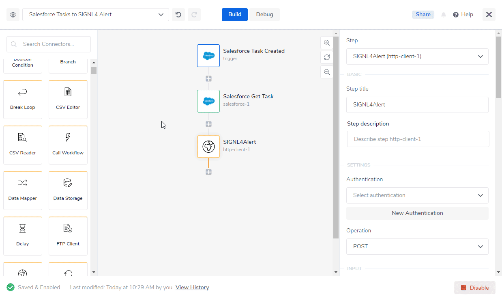
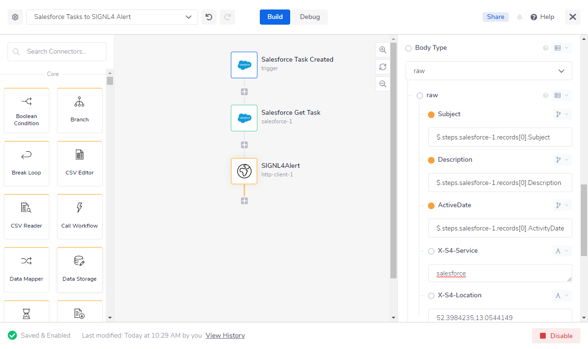
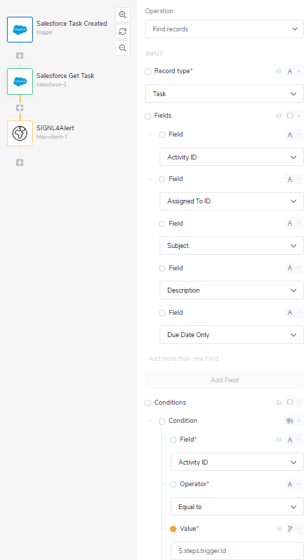
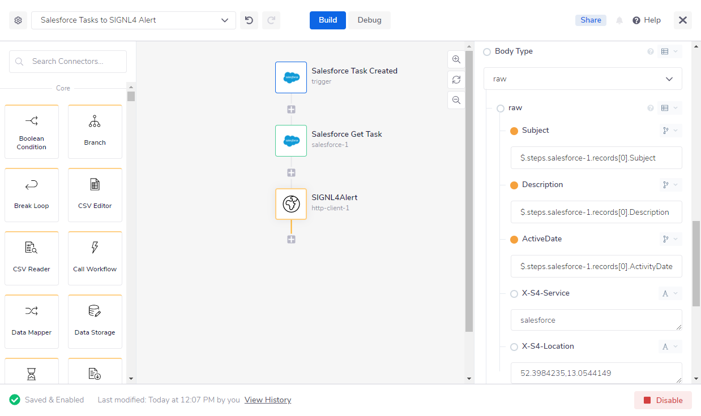

# Mobile Alarmierung per App, SMS und Anruf für Tray.io

Mobile Alarmierung mit Tracking, Bereitschafts-Planung und Eskalation für Tray.io.

## Warum SIGNL4

Tray.io ist eine Integrations-Plattform, die es ermöglicht Prozesse verschiedenster Cloud-Anwendungen zu automatisieren. Es kann helfen den eigenen Integrations-Aufwand deutlich reduzieren. Die Integration dieser leistungsstarken Plattform mit SIGNL4 kann Ihren täglichen Betrieb durch die zuverlässige Alarmierung mobiler Teams verbessern, egal wo sich diese befinden.

## So funktioniert es

Alles, was für die Verknüpfung von Tray.io mit SIGNL4 nötig ist, ist ein Http Client Connector in Ihrem Tray.io Workflow. Dies ermöglicht den Aufruf des SIGNL4-Webhooks und somit die Auslösung eines SIGNL4-Alarms.

## Integration

- Alarmierung von Wartungsteams in SIGNL4 per mobilem Push, Text und Sprache
- Anbindung an SIGNL4 per Email (SMTP API)
- Transparente Quittierung in der mobilen App
- Eskalation von Alarmen wenn eine bestimmte Zeit verstrichen ist
- Team-Kommunikation innerhalb von Alarmen
- Nachvollziehbarkeit der Störungs-Behebung
- Integrierte Bereitschafts-Planung, um die richtigen Personen zur richtigen Zeit zu alarmieren
- Alarmierung über kritische IoT-Status
- Mögliche Zwei-Wege-Integration zur Interaktion mit Geräten

## Szenarien

- Workflow-Automatisierung
- DevOps
- IT-Betriebsabläufe
- Service-Management
- IoT
- Produktion und Fertigung, Versorgungs-Sektor, Öl und Gas, Landwirtschaft, etc.

## Und so funktioniert es

### Integration von SIGNL4 mit Tray.io

In unserem Beispiel werden wir die Informationen über einen neuen Task in Salesforce an unser SIGNL4-Team senden.

SIGNL4 ist eine mobile App mit der Teams schneller und effektiver auf kritische Alarme, technische Störungen und dringende Service-Aufträge reagieren können. Holen Sie sich die App unter https://www.signl4.com.

### Voraussetzungen

Ein SIGNL4-Konto (https://www.signl4.com)

Ein Tray.io Konto (https://www.tray.io)

Ein Salesforce Konto (https://www.salesforce.com) für unser Beispiel(optional)

#### Integrations-Schritte

1. Logon auf Tray.io  

Loggen Sie sich in der Tray.io Plattform unter https://app.tray.io ein.

2. Anlegen des Workflow  

Nun können Sie einen neuen Workflow anlegen, der aus drei Schritten besteht:

1. Trigger: Salesforce Task Created
2. Salesforce Get Task
3. Http Client: Hier senden wir den HTTP-POST-Request an SIGNL4, um den Alarm auszulösen.

3. Salesforce-Integration  

Unser Auslöser ist ein Salesforce Trigger mit der Operation On Record Create or Update. Dies erfordert eine Authentifizierung mit Ihrem bestehenden Salesforce-Konto. Der Trigger löst unseren Workflow jedes Mal aus, wenn ein neuer Task in Salesforce erstellt wurde.

Der zweite Schritt in unserem Workflow ist ein Salesforce Connector mit der Operation Find records und mit dem  Record type Task. Wir verwenden dies, um den zuvor erstellten Task mit der Activity ID $.steps.trigger.trigger.Id zu finden.

4. Http Client konfigurieren  

Wir senden einen HTTP-Push-Request an SIGNL4, um einen Alarm auszulösen. Die URL ist Ihre SIGNL4 Webhook-URL inklusive Ihres Team-Secrets. Der Content-Type ist application/json und der Body enthält die JSON-Daten. In unserem Fall setzen wir den Body dynamisch aus den Salesforce-Task-Daten zusammen.

6. Testen Sie es  

Um den Workflow zu testen können Sie einem neuen Task in Salesforce anlegen. Dies löst den Workflow in Tray.io aus und sendet dann die Task-Daten an Ihr SIGNL4-Team.

Ein Beispiel finden Sie auf in GitHub:
https://github.com/signl4/signl4-integration-tray-io
