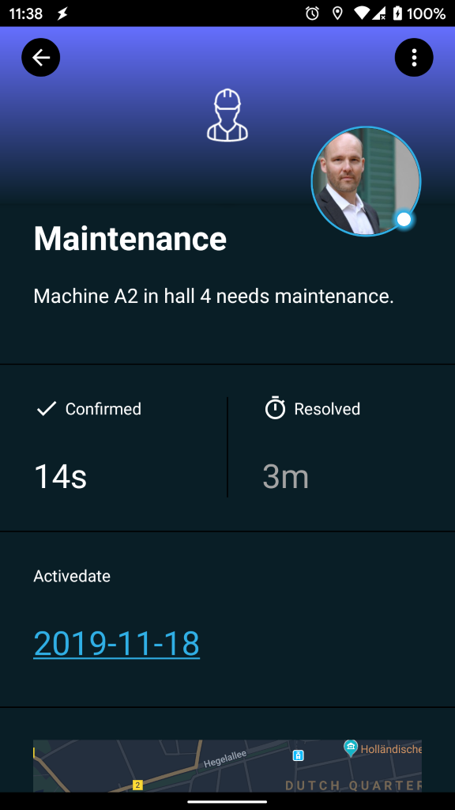
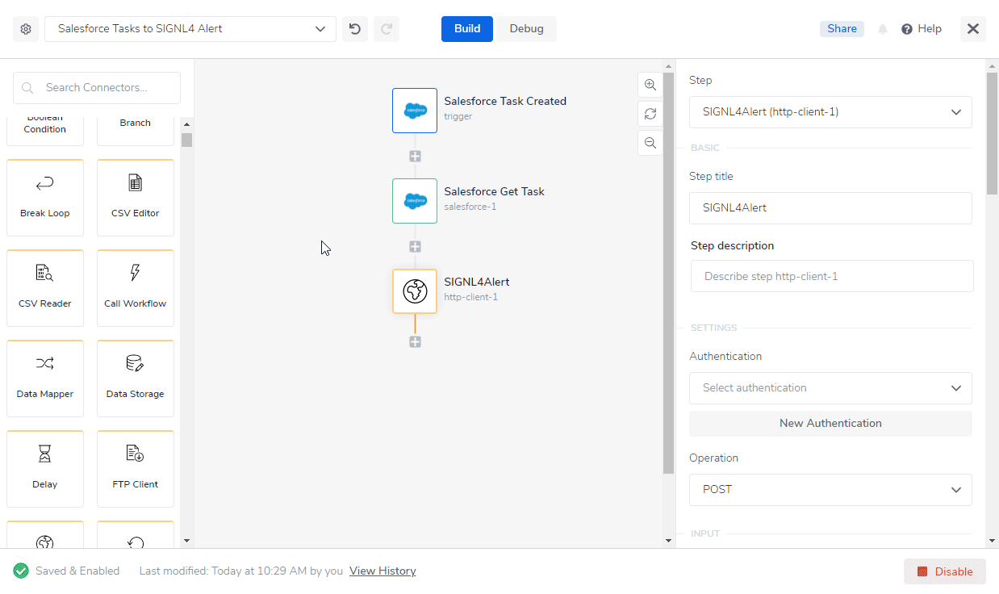
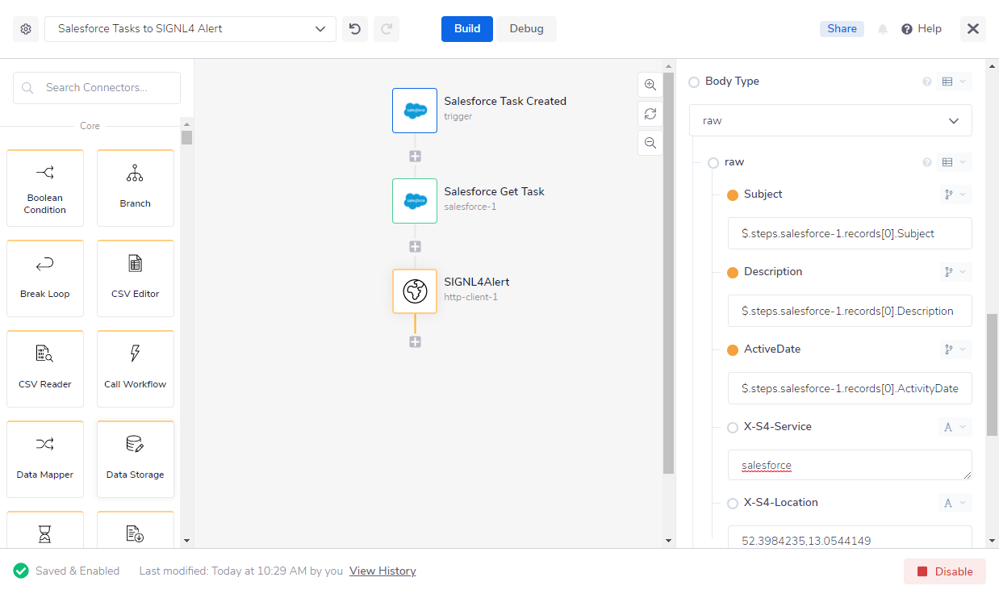
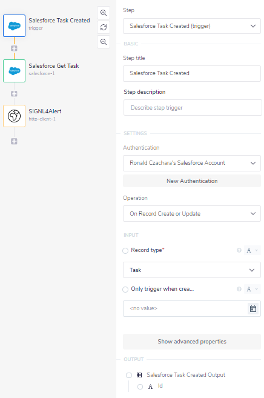
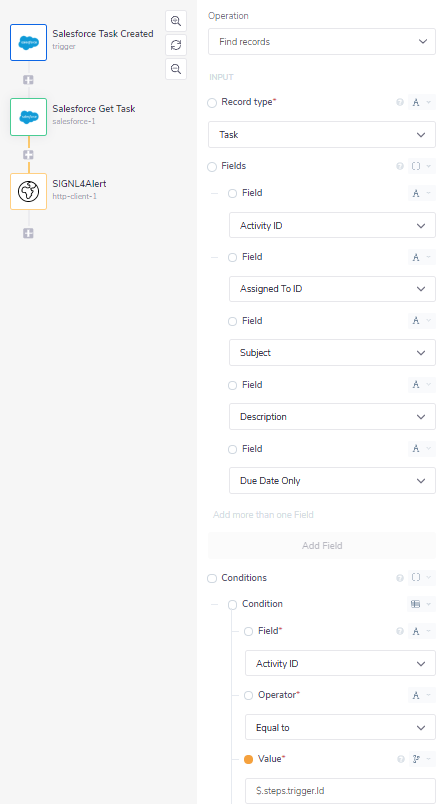
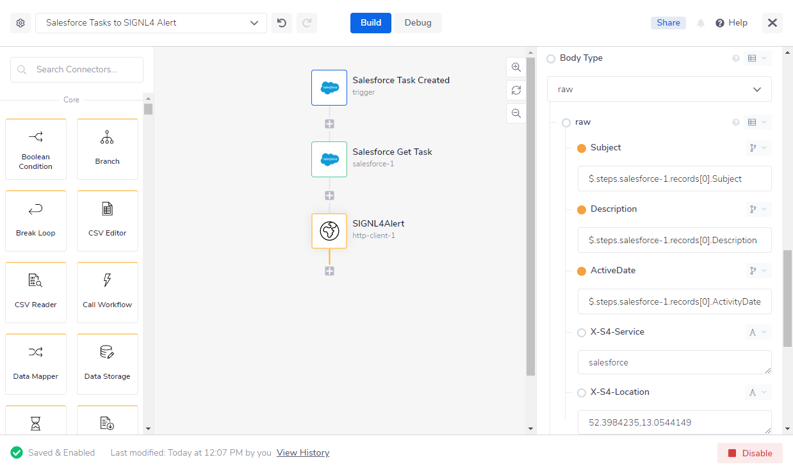

# Mobile alerting with tracking & escalation for Tray.io

Mobile alerting with tracking, duty planning and escalation for Tray.io.

## Why SIGNL4

Tray.io is an integration platform that allows you to automate processes across any cloud stack. It helps to reduce your own integration efforts significantly. Pairing this powerful platform with SIGNL4 can enhance your daily operations with an extension to your team wherever it is.

## How it Works

All it takes to pair Tray.io and SIGNL4 is a Http Client Connector in your Tray.io workflow. This allows to call the SIGNL4 webhook and to trigger an according alert.

## Integration Capabilities

- Service engineers alerted via mobile push, text and voice
- Integration with SIGNL4 via webhook or email (SMTP)
- Staff can acknowledge and take ownership for critical events that occur
- Alerts are escalated in case of no response
- Communicate within an alert to address a particular problem
- Tracking and visibility of problem solutions
- Integrated on-call duty planning
- Alert on critical IoT device states
- Two-way integration to interact or set the device state

## Scenarios

- Workflow automation
- DevOps
- IT operations
- Service Management
- IoT
- IT, Manufacturing, Utility, Oil and Gas, Agriculture, etc.

## How To Integrate

### Integrating SIGNL4 with Tray.io

In our example we will send information about a new Task in Salesforce to our SIGNL4 team.

SIGNL4 is a mobile alert notification app for powerful alerting, alert management and mobile assignment of work items. Get the app at https://www.signl4.com.

### Prerequisites

A SIGNL4 (https://www.signl4.com) account

A Tray.io (https://www.tray.io) account

A Salesforce account (https://www.salesforce.com) for our example (optional)

#### Integration Steps

1. Logon to Tray.io  

Log on to the Tray.io platform at https://app.tray.io.

2. Create the Workflow  

Now you can create a new workflow consisting of three steps:

1. Trigger: Salesforce Task Created
2. Salesforce Get Task
3. Http Client: Here we send the HTTP POST request to SIGNL4 in order to trigger the alert.

3. Salesforce Integration  

Our Trigger is a Salesforce Connector with the operation On Record Create or Update. This requires an authentication with your existing Salesforce account. The Trigger will start our flow each time a new Task has been created in Salesforce.

The second step in our flows is a Salesforce Connector with the operation Find records and with the Record type Task. We use this to find the previously creates task with the Activity ID $.steps.trigger.Id.

4. Configure the Http Client  

We send an HTTP Push request to SIGNL4 in order to trigger an alert. The URL is your SIGNL4 webhook URL including your team secret. The content-type is application/json and the Body is the JSON payload. In our case we assemble the body dynamically from the Salesforce Task data.

5. Test It  

For testing you can create a new Task in Salesforce. This will trigger the workflow in Tray.io and as a result send the task data to your SIGNL4 team.

You can find a sample in GitHub:
https://github.com/signl4/signl4-integration-tray-io
